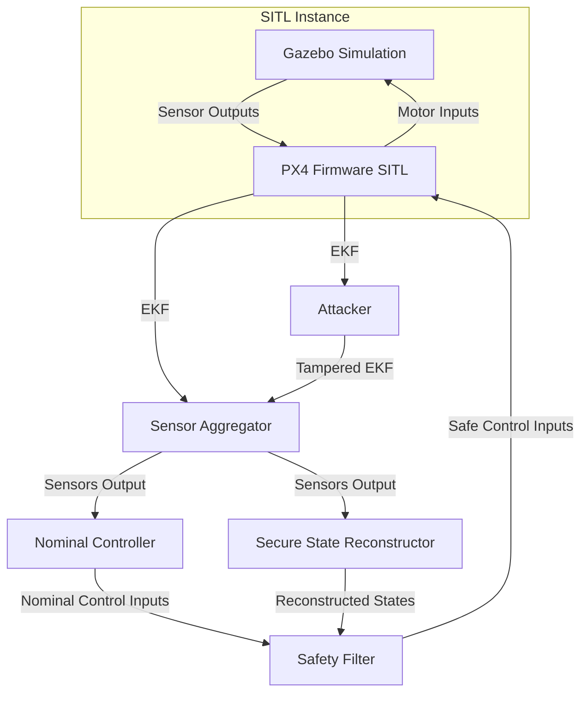
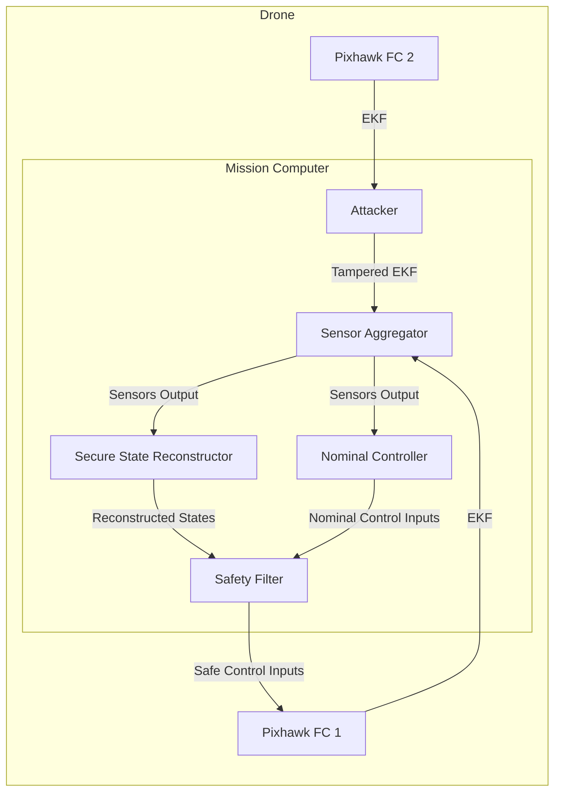

<!--toc:start-->
- [Installation](#installation)
  - [Pre-requisites](#pre-requisites)
  - [Containerised Deployement](#containerised-deployement)
    - [Simulation Environment](#simulation-environment)
    - [MicroXRCE-DDS Agent](#microxrce-dds-agent)
    - [ROS 2 Development Environment](#ros-2-development-environment)
  - [Native Deployment (WIP | SKIP FOR NOW)](#native-deployment-wip-skip-for-now)
- [Running (in Containers)](#running-in-containers)
  - [Launch Simulation](#launch-simulation)
  - [Launch DDS Agent](#launch-dds-agent)
  - [Launch Offboard Control Modules](#launch-offboard-control-modules)
  - [Launch Secure State Reconstruction Nodes](#launch-secure-state-reconstruction-nodes)
  - [Initiate the Regular Controller](#initiate-the-regular-controller)
- [Updating (in Containers)](#updating-in-containers)
- [Plan for Implementation](#plan-for-implementation)
  - [Simulation](#simulation)
  - [Hardware](#hardware)
- [Sequential Initialisation](#sequential-initialisation)
  - [Start Regular Controller](#start-regular-controller)
  - [Start Attacker](#start-attacker)
  - [Start Safe Controller](#start-safe-controller)
  - [Start State Reconstruction](#start-state-reconstruction)
<!--toc:end-->

# Installation

## Pre-requisites

- Docker

## Containerised Deployement

```bash
# First clone the repository
git clone --recursive https://github.com/juniorsundar-tii/px4-secure-state-reconstruction.git
```

### Simulation Environment

To launch the simulation environment. First run on your host terminal:

```bash
# Run once to ensure that any remote client (like the container)
# to connect to the X Server. Essentially allows you to run GUI
# apps launched in the container to be forwarded to your local system
xhost +
```

Next, we can enter the simulation docker environment:

```bash
# To launch a SITL with Gazebo-Harmonic GUI open the cloned repo in vscode. 
# Select the open from container option.
# Make sure you have the vscode devcontainers installed.
```


### MicroXRCE-DDS Agent

The DDS agent is necessary to transfer the uORB topics from within the
autopilot into ROS 2 topics. This can also be deployed in container
environment. The docker compose associated with the current development container spawns MicroXRCE-DDS.


### ROS 2 Development Environment

For ease of use, the devepment container will have all the cloned repo mounted with read write permissions.

Your environment will be contrained within the development container so your host will only see the changes in the files you make.

We need to first build the workspace:

```bash
CTRL + B
source install/setup.bash
```

## Launch Simulation
The simulation launches automatically when spawning the dev container.

## Launch DDS Agent
The DDS Agent launches automatically when spawning the dev container.


## Launch Offboard Control Modules

```bash
ros2 launch px4_offboard_control module_launch.py
```

If successful, then the drone should be hovering in the Gazebo simulation
environment.

## Launch Secure State Reconstruction Nodes

```bash
ssr_ros_ws ros2 launch px4_ssr ssr_launch.py # This will launch the estimator and filter
```

## Initiate the Regular Controller

```bash
ssr_ros_ws ros2 topic pub -1 /start_ssr std_msgs/msg/Empty "{}"
```

# Updating

Write new code and build it with in the devcontainer.

# Plan for Implementation


## Simulation



## Hardware



# Sequential Initialisation

## Start Regular Controller

The drone will only hover until a toggle is provided:

```bash
ros2 topic pub -1 /start_ssr std_msgs/msg/Empty "{}"
```

## Start Attacker

Attacker can be toggled with this:

```bash
ros2 topic pub -1 /safe_control std_msgs/msg/Bool "data: true" # or "data: false"
```

## Start Safe Controller

The standard controller will be used until this is initialised:

```bash
ros2 topic pub -1 /safe_control std_msgs/msg/Bool "data: true" # or "data: false"
```

## Start State Reconstruction

State reconstruction can be initialised with this:

```bash
ros2 topic pub -1 /state_reconstruction std_msgs/msg/Bool "data: true" # or "data: false"
```

## Querying States

It is possible to query what the state of each of the above systems are by
getting the appropriate parameter:

```bash
# Get state of safe controller/safety filter (boolean)
ros2 param get /offboard_control_xvel safe_control_state

# Get state of attacker (boolean)
ros2 param get /attacker attacker_state

# Get state of state reconstructor (boolean)
ros2 param get /safe_controller state_reconstruction_state
```


### SITL Model SDF file generation
For instance, with _holybro_x500_ as model:
- [One time only] generate `model.sdf` in `gz-models/holybro_x500`
  ```
  cd gz-models
  ros2 launch model.launch.py vehicle_model:=holybro_x500
  ```

### Update plugins
- Optionally, the plugins can be updated via
  ```
  # for instance: libmavlink_hitl_gazebosim.so
  cd gz-plugins
  docker run --rm -itd --name extractor --entrypoint /bin/sh ghcr.io/tiiuae/px4-gzsim-plugins:latest && docker cp extractor:/artifacts/libmavlink_hitl_gazebosim.so . && docker kill extractor
